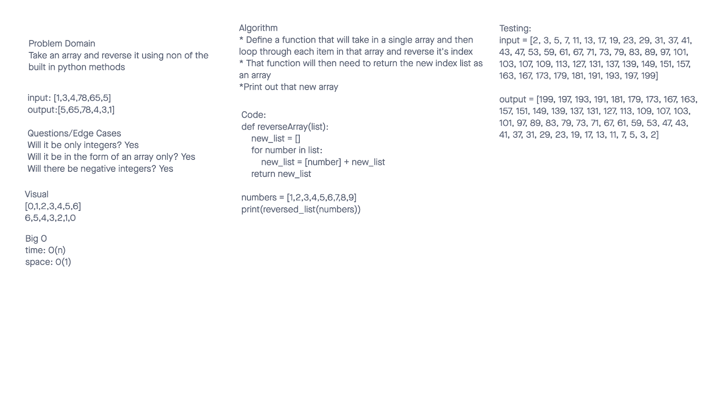

# Reverse an Array
### Code Challenge 1
The Code Challenge is called Array Reverse and what we had to do was reverse a list without using any built in functions
### Code Challenge 2
Write a function called insertShiftArray which takes in an array and a value to be added. Without utilizing any of the built-in methods available to your language, return an array with the new value added at the middle index.
### Code Challenge 3
Write a function called BinarySearch which takes in 2 parameters: a sorted array and the search key. Without utilizing any of the built-in methods available to your language, return the index of the array’s element that is equal to the value of the search key, or -1 if the element is not in the array.

## Whiteboard Process
### Code Challenge 1

### Code Challenge 2

### Code Challenge 3

## Approach & Efficiency
### Code Challenge 1
We defined a function that will take in a single array, loop through it, and return the array in reverse.
### Code Challenge 2
Create an array that holds and accepts values

- Insert a value in the midpoint in the existing array

- return the new array with the added value
### Code Challenge 3
Use Binary Search to find they key value in a list
- we solved it iteratively and used to pointers and incrementing to find the key

## Collaborators
### Code Challenge 1
Alex Payne
### Code Challenge 2
Bionca Bond
### Code Challenge 3
Issiah Burkes
