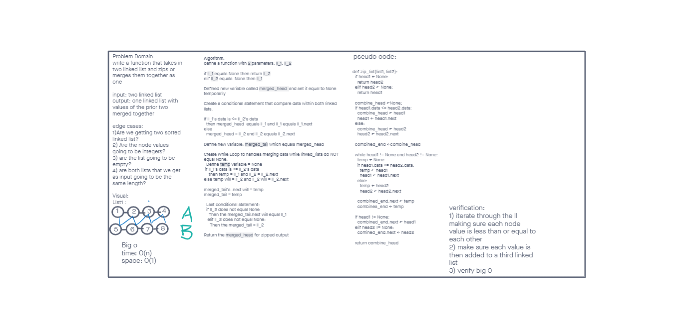

# Zipped Linked List
write a function that takes two linked list as arguments and returns on linked list with each node value merged

# Whiteboard Process

## Approach & Efficiency
- First we defined a function that takes two linked list as arguments
- we defined two pointers that equal the head of each linked list
- then we used a while loop to iterate through each linked list and comparing the values and sending them to a new list
- we handled if the head equals none to return list 1 or 2

# Collaborators
code challenge 8: eddie ponce
