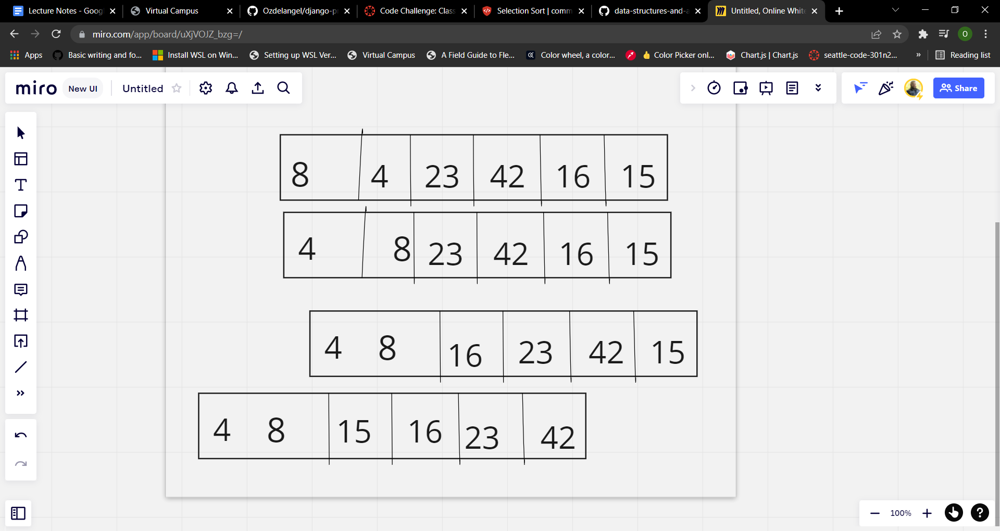

# How to do insertion sort

## Step 1
- define a function that takes in a list
- set a variable for the length of the list
- you want to use index 1 and on

## Step 2
- using a For loop run through the list and tell it what to do
- we want to set a variable for what we are going to be using to compare `list[i`]

## Step 3
- next we are going to use a while loop to constantly keep checking until we are done with the list or it is False
- so are checks go if the list at index I - 1 is greater than value to sort we're going to switch those around
- the reason we are using - 1 is because we are comparing the index the the left of whatever the I is

## Step 4
-  keep making checks until the end and once it reaches the end return the list

